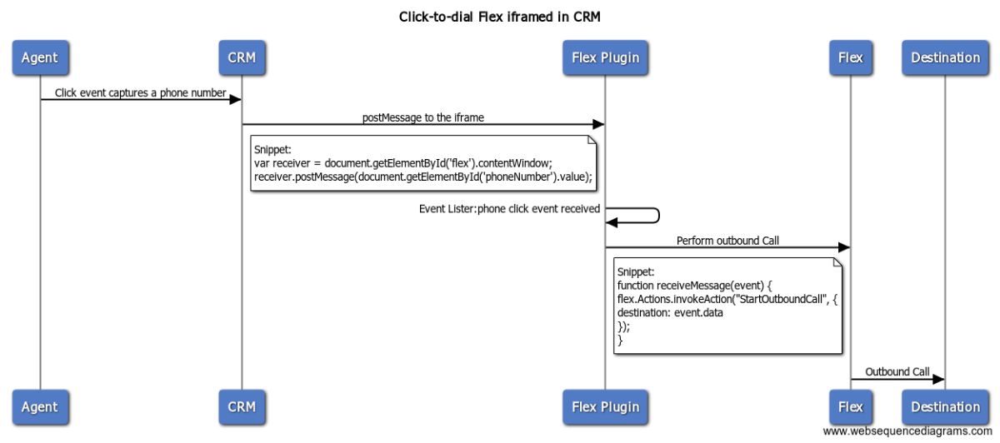

# Your custom Twilio Flex Plugin


Twilio Flex Plugins allow you to customize the appearance and behavior of [Twilio Flex](https://www.twilio.com/flex). If you want to learn more about the capabilities and how to use the API, check out our [Flex documentation](https://www.twilio.com/docs/flex).
Flex Dialpad documentation can be found at [Flex Dialpad](https://www.twilio.com/docs/flex/dialpad).


In this plugin we have used Twilio Flex's Native Outbound Calling API i.e. Action Framework's action startOutboundCall. 
Read more about this Action [here](http://media.twiliocdn.com/sdk/js/flex/releases/1.17.0-rc2/docs/Actions.html#StartOutboundCall)


A high level flow diagram explaining the flow is shown below


## Screenshot of what this sample looks 


## Setup

Make sure you have [Node.js](https://nodejs.org) as well as [`npm`](https://npmjs.com) installed.

Afterwards, install the dependencies by running `npm install`:

```bash
cd 

# If you use npm
npm install
```

## Development

In order to develop locally, you can use the Webpack Dev Server by running:

```bash
npm start
```

This will automatically start up the Webpack Dev Server and open the browser for you. Your app will run on `http://localhost:8080`. If you want to change that you can do this by setting the `PORT` environment variable:

```bash
PORT=3000 npm start
```

When you make changes to your code, the browser window will be automatically refreshed.

## Deploy

Once you are happy with your plugin, you have to bundle it in order to deploy it to Twilio Flex.

Run the following command to start the bundling:

```bash
npm run build
```

Afterwards, you'll find in your project a `build/` folder that contains a file with the name of your plugin project. For example, `plugin-example.js`. Take this file and upload it into the Assets part of your Twilio Runtime.

Note: Common packages like `React`, `ReactDOM`, `Redux` and `ReactRedux` are not bundled with the build because they are treated as external dependencies so the plugin will depend on Flex to provide them globally.